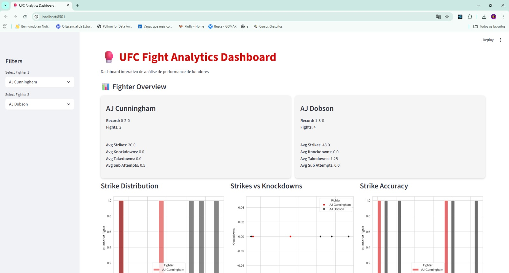

# 🥊 UFC Fight Analytics Dashboard

Interactive **Sports Analytics Dashboard** built with **Python, Streamlit and Machine Learning** to analyze fighter performance and simulate fight outcomes.

## Project Overview

This project explores UFC fight statistics and builds an interactive dashboard where users can:

- Compare fighter performance
- Analyze striking, grappling and finishing skills
- Visualize fighter profiles
- Predict fight outcomes using a Machine Learning model

The goal was to combine **data visualization, sports analytics and predictive modeling** in one application.

---

## Features

### Fighter Comparison
Compare two fighters across multiple performance metrics:

- Strikes landed
- Takedowns
- Knockdowns
- Submission attempts

### Radar Skill Profile
Visualizes fighter strengths across:

- Striking
- Grappling
- Knockdowns
- Submissions
- Control

### Percentile Ranking
Shows how each fighter ranks relative to the entire UFC dataset.

### Machine Learning Prediction
A Logistic Regression model predicts the probability of winning a fight based on fighter statistics.

---

## Tech Stack

- Python
- Pandas
- NumPy
- Seaborn
- Matplotlib
- Streamlit
- Scikit-learn

---

## Machine Learning Model

The model was trained using:

Features:

- Strikes
- Takedowns
- Knockdowns
- Submission attempts
- Strike accuracy
- Distance fighting
- Clinch fighting
- Ground control

Target:

- Fight outcome (Win / Loss)

Model:

- Logistic Regression

Accuracy:

~74%

---

## Dashboard Preview



---

## Running the Project

Clone the repository:

```bash
git clone https://github.com/yourusername/ufc-fight-analytics.git


cd ufc-fight-analytics

pip install -r requirements.txt

pip install -r requirements.txt
